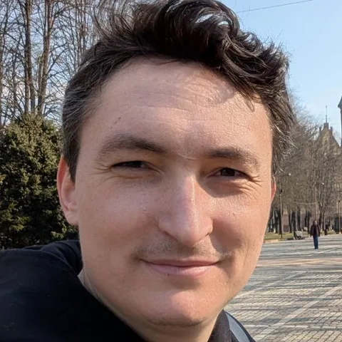

# Eugene Selikhov

**Senior Backend Engineer** · Berlin, Germany · EU citizen · Open to relocation

[LinkedIn](https://www.linkedin.com/in/selikhovevgenii/) · [GitHub](https://github.com/selikhovel/) · <a href="/cv.pdf" download>Download CV as PDF</a>

## Professional Summary

Senior Backend Engineer with 10+ years of experience turning complex business domains into clean, scalable systems, from automotive parts variation logic to global real estate data platforms. Passionate about domain ownership and close business collaboration; deep expertise in DDD, event-driven architecture and modern .NET, with a proven track record of leading greenfield platforms, legacy modernisation and technical hiring. Actively adopting and introducing AI agentic development into engineering workflows.

## Technical Skills

**Backend & Architecture** — C#, .NET Core, .NET 9, .NET 10, ASP.NET Core, Web API, EF Core, Microservices, Modular Monolith, Clean Architecture, CQRS, MediatR, DDD, TDD

**Data & Messaging** — PostgreSQL, MongoDB, Redis, RabbitMQ, Kafka

**Cloud & DevOps** — Azure, AWS, Docker, Terraform, GitLab CI/CD, Git

**Practices** — Unit & Integration Testing, Agile / Scrum, SDLC

**AI & Developer Tooling** — AI-assisted and agentic development, Gemini (Google Cloud AI ecosystem), AI tooling adoption and team enablement

## Work Experience

### Senior Backend Engineer — Colliers Global, Global Tech Hub

*Jan 2026 – Present · internal transfer from Colliers International Germany*

Tech stack: ASP.NET Core, .NET 10, Kafka, PostgreSQL

- Founding engineer of the Global Tech Hub; led initial team setup, establishing engineering workflows, delivery processes and onboarding from the ground up.
- Lead engineer for the core domain product; driving domain discovery in close collaboration with business stakeholders to define bounded contexts and the domain model following DDD practices.
- Organised and led technical interviews for backend engineer candidates, owning the hiring bar for the team.
- Championed Gemini and Google Cloud AI adoption; demonstrated concrete benefits to navigate organisational resistance, integrated agentic workflows into the SDLC, and established team AI tooling standards and collaboration culture.

### Senior Backend Engineer — Colliers International Germany

*Apr 2025 – Dec 2025*

Tech stack: .NET 9, ASP.NET Core, Azure, PostgreSQL, Docker, Terraform

- Led backend development of a new enterprise analytics platform from scratch; owned the full backend architecture, domain model and database schema.
- Reverse-engineered a 15-year-old legacy system through deep domain analysis; redesigned the domain model from business rules extracted from the legacy codebase, delivering a zero-disruption migration.
- Defined CI/CD pipelines with DevOps and built delivery processes and rituals for a newly formed team.

### Senior Backend Engineer — Complevo GmbH, Germany

*Nov 2019 – Mar 2025 · Daimler / Mercedes-Benz*

Tech stack: .NET Core, ASP.NET Core, EF Core, PostgreSQL, RabbitMQ, Docker, GitLab CI/CD

- Developed event-driven backend services for a B2B fleet management platform serving 100,000+ customers across Europe and the US.
- Led R&D of a data-intensive automotive inventory system (modular monolith); implemented CQRS, MediatR and DDD patterns throughout.
- Took technical ownership of automotive repair kit and parts variation logic; led business analysis with stakeholders, resolved complex catalogue rules across vehicle configurations and drove third-party data ingestion design.
- Optimised critical SQL queries and backend algorithms, reducing API response times below SLA thresholds; drove cross-team technical alignment.

### Senior Backend Engineer — Broctagon Solutions Ltd.

*Sep 2015 – Oct 2019 · Remote*

Tech stack: C#, .NET Framework, MT4/MT5 plugins, WPF, SignalR, Rx.NET, C++/CLI interop, REST API, Angular, AWS

- Built high-availability REST APIs for desktop, web and mobile trading apps achieving 99.99% uptime.
- Automated risk management workflows; led technical staff to deliver mission-critical features to tight deadlines; managed AWS infrastructure.

### .NET Developer — Neolant-Tenax Ltd.

*Mar 2015 – Sep 2015*

- Developed enterprise systems for the nuclear industry: a project and construction management platform for power plant construction, and an industrial information system for facility decommissioning and radioactive waste control.

### .NET / WPF Developer — Early roles

*2013 – 2015*

- Manufacturing execution system and a cross-platform governmental performance appraisal system.

## Languages

**English** — Professional working proficiency · **German** — Intermediate · **Russian** — Native

## Education

**Kaliningrad State Technical University** — Postgraduate Research, E-learning & Educational Assessment Tools, 2013–2014

**Kaliningrad State Technical University** — MSc in Applied Information Technology in Economics, 2012
